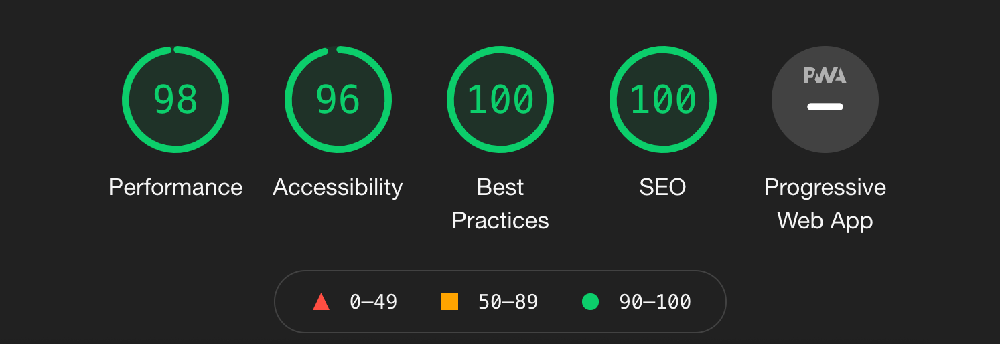

# Robonaut Website

[https://robonaut.be](https://robonaut.be)




## Install dependencies

```sh
$ npm i
```

## Running tests
```sh
$ npm t
```

## Develop

```sh
$ npm start
```

## Deployment

```sh
$ npm run build
```
